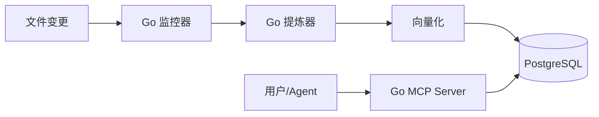

# Project Cortex (agent-mem)

> **AI Agent 认知资产管理系统**
> 专为 AI Agent（Claude, Gemini, Codex）设计的本地优先知识管理系统，纯 Go 实现，提供自动入库、语义检索与对话炼金能力。

## 1. 项目概览

Project Cortex 是一个智能化的知识库中间件，旨在解决 AI Agent 长期记忆与知识即时更新的问题。它通过文件系统监控自动捕获文档变更，利用向量数据库实现语义检索，并能从对话日志中自动提炼高价值洞见。

### 核心能力
*   **自动入库 (Auto-Ingest)**: 实时监控指定目录（如 `docs/`, `specs/`），零手动干预。
*   **语义检索 (Semantic Search)**: 基于 Qwen Embedding 与 pgvector 的高精度向量检索。
*   **意图路由 (Intent Routing)**: 自动识别查询意图，选择最佳检索策略。
*   **对话炼金 (Dialogue Distillation)**: 从聊天记录中提取结构化洞见（Insight）。
*   **版本演进 (Versioning)**: 智能仲裁新旧知识，支持语义去重与历史回溯。

## 2. 技术栈与架构

### 核心组件
*   **Database**: PostgreSQL 16 + `pgvector` (存储向量与元数据)
*   **Core (Go)**: Go 1.25+ 编写的单一二进制文件，包含：
    *   **MCP Server**: 提供 Model Context Protocol 标准接口。
    *   **Watcher**: 基于 `fsnotify` 的实时文件监控。
    *   **Ingester**: 智能入库流水线（LLM 提炼、向量化、版本管理）。
*   **LLM Provider**: Qwen (通义千问) 全家桶 (Embedding, Turbo, Plus)

### 架构数据流


## 3. 快速启动

### 环境准备
1.  **启动数据库**:
    ```bash
    docker-compose up -d
    ```
2.  **配置环境**:
    检查 `~/.config/agent_tools.env` 或 `.env` 是否包含 `DASHSCOPE_API_KEY` 和 `DATABASE_URL`。

### 编译与运行
1.  **编译**:
    ```bash
    cd mcp-go
    go build -o ../out/agent-mem-mcp ./cmd/agent-mem-mcp
    ```
2.  **启动服务**:
    ```bash
    # 同时启动 MCP 服务和文件监控
    ./out/agent-mem-mcp --transport http --watch
    ```

## 4. 目录结构说明

*   `mcp-go/`: 纯 Go 实现的核心源码。
*   `config/`: 配置文件 (`settings.yaml`)。
*   `docs/`: 项目文档与架构设计。
*   `scripts/`: 自动化测试脚本。
*   `out/`: 编译输出目录。

## 5. 开发规范

*   **Go**: 遵循标准 Go fmt 与 idioms。
*   **提交信息**: 采用 Conventional Commits (e.g., `feat: add semantic router`).
*   **配置**: 核心配置位于 `config/settings.yaml`。

## 6. 任务状态
*   **已完成**: 纯 Go 架构迁移 (Task-004)，包括 Watcher、Ingester 和 MCP Server。
*   **测试**: E2E 测试已通过，验证了全链路的可靠性。