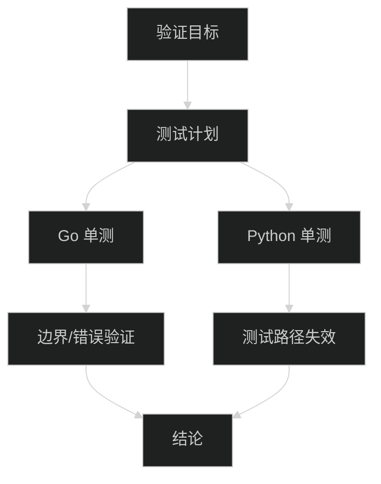

# agent-mem 工具验证与边界测试报告

> 📅 **日期**: 2026-01-24 11:43:09
> 📁 **项目路径**: /home/junknet/Desktop/agent-mem
> 🎯 **目标**: 确认当前工具可用性，执行实际测试，覆盖边界场景并尽量发现潜在问题
> 🧪 **测试基线**: 仓库内单元测试 + Go 栈核心逻辑验证

---

## 1. 验证范围与方法

- **验证对象**: Go 版 MCP 服务（`mcp-go`）为主，Python 旧链路测试作为参考
- **验证方法**: 运行现有单元测试；针对边界与异常场景检查是否有测试覆盖
- **输出要求**: 展示真实命令与原始输出，记录未覆盖场景与风险



---

## 2. 环境信息

- **Go 版本**: `go version go1.25.5 X:nodwarf5 linux/amd64`
- **Python 版本**: `Python 3.13.11`
- **运行方式**: 本地执行单测；未启动数据库与外部 API

---

## 3. 测试报告

### 3.1 执行的测试

| 测试项 | 命令 | 结果 |
|:---|:---|:---|
| Go 单元测试 | `go test ./...` (workdir: `mcp-go`) | ✅ 通过 |
| Python 单元测试 | `PYTHONPATH=. .venv/bin/python -m unittest discover -s tests` | ❌ 失败（导入路径失效） |

### 3.2 实际输出

**Go 单元测试输出**

```text
ok  	agent-mem-mcp/cmd/agent-mem-mcp	0.003s
```

**Python 单元测试输出**

```text
EEE
======================================================================
ERROR: test_ingester (unittest.loader._FailedTest.test_ingester)
----------------------------------------------------------------------
ImportError: Failed to import test module: test_ingester
Traceback (most recent call last):
  File "/usr/lib/python3.13/unittest/loader.py", line 396, in _find_test_path
    module = self._get_module_from_name(name)
  File "/usr/lib/python3.13/unittest/loader.py", line 339, in _get_module_from_name
    __import__(name)
    ~~~~~~~~~~^^^^^^
  File "/home/junknet/Desktop/agent-mem/tests/test_ingester.py", line 7, in <module>
    from src import config as config_module
ImportError: cannot import name 'config' from 'src' (unknown location)


======================================================================
ERROR: test_llm (unittest.loader._FailedTest.test_llm)
----------------------------------------------------------------------
ImportError: Failed to import test module: test_llm
Traceback (most recent call last):
  File "/usr/lib/python3.13/unittest/loader.py", line 396, in _find_test_path
    module = self._get_module_from_name(name)
  File "/usr/lib/python3.13/unittest/loader.py", line 339, in _get_module_from_name
    __import__(name)
    ~~~~~~~~~~^^^^^^
  File "/home/junknet/Desktop/agent-mem/tests/test_llm.py", line 6, in <module>
    from src import config as config_module
ImportError: cannot import name 'config' from 'src' (unknown location)


======================================================================
ERROR: test_mcp_server (unittest.loader._FailedTest.test_mcp_server)
----------------------------------------------------------------------
ImportError: Failed to import test module: test_mcp_server
Traceback (most recent call last):
  File "/usr/lib/python3.13/unittest/loader.py", line 396, in _find_test_path
    module = self._get_module_from_name(name)
  File "/usr/lib/python3.13/unittest/loader.py", line 339, in _get_module_from_name
    __import__(name)
    ~~~~~~~~~~^^^^^^
  File "/home/junknet/Desktop/agent-mem/tests/test_mcp_server.py", line 3, in <module>
    from src.mcp_server import _auto_relative_path
ModuleNotFoundError: No module named 'src.mcp_server'


----------------------------------------------------------------------
Ran 3 tests in 0.000s

FAILED (errors=3)
```

---

## 4. 边界与异常验证覆盖

✅ 已覆盖（Go 单测）
- **路径穿越防护**: `safeResolvePath` 拒绝 `../` 路径
- **Front Matter 回写一致性**: `ensureFrontMatter` 轮转后正文一致
- **向量维度/一致性**: Mock 向量维度与确定性
- **数据库地址归一化**: `postgresql+psycopg://` 归一化为 `postgresql://`

⚠️ 未覆盖/未验证
- **端到端入库链路**: 需要 DB + 外部 API 环境（未启动）
- **Python 旧链路单测**: 测试导入路径失效，暂无法执行

---

## 5. 发现的问题与风险

### 🐛 问题 1：Python 单测导入路径失效
- **现象**: `tests/` 里引用 `src` 模块，但实际源码已迁移至 `src_legacy`
- **影响**: Python 单测无法运行，CI/回归测试存在断档风险
- **建议**: 视是否保留 Python 链路，选择以下之一
  - 迁移/删除旧单测，仅保留 Go 测试
  - 增加兼容层（例如保留 `src/` 作为兼容包）

### ⚠️ 风险 1：缺少 E2E 验证
- **现象**: 当前验证未覆盖完整入库/检索链路
- **影响**: 真实运行可能暴露数据库连接、Rerank 依赖等问题
- **建议**: 启动 DB 后执行 `scripts/e2e_test_go.py`

---

## 6. 优化建议

- **测试分层**: 统一整理 Python 旧链路与 Go 新链路的测试入口
- **CI 建议**: Go 单测必须跑，E2E 作为可选阶段
- **文档同步**: 明确标注 Python 代码为 legacy，避免误用

---

## 7. 自主决策记录

| 时间 | 决策点 | 选择 | 理由 |
|:---|:---|:---|:---|
| 11:43 | 测试优先级 | 先跑 Go 单测，再尝试 Python 单测 | Go 为当前主链路，先验证核心逻辑 |
| 11:44 | E2E 测试 | 暂未执行 | 需要 DB 与外部 API 环境，当前未启动 |

---

## 8. 使用与复测建议

- **Go 单测**: `cd mcp-go && go test ./...`
- **E2E（需 DB）**: `PYTHONPATH=. .venv/bin/python scripts/e2e_test_go.py`
- **服务运行**:
  - `docker-compose up -d`
  - `cd mcp-go && go build -o ../out/agent-mem-mcp ./cmd/agent-mem-mcp`
  - `../out/agent-mem-mcp --watch --transport http`

---

## 9. 结论

- ✅ **Go 主链路单测通过**，核心逻辑可用性得到初步验证
- ❌ **Python 旧链路单测不可用**，需明确去留或修复
- ⚠️ **完整可用性仍需 E2E 验证**（数据库 + 真实 API 环境）

